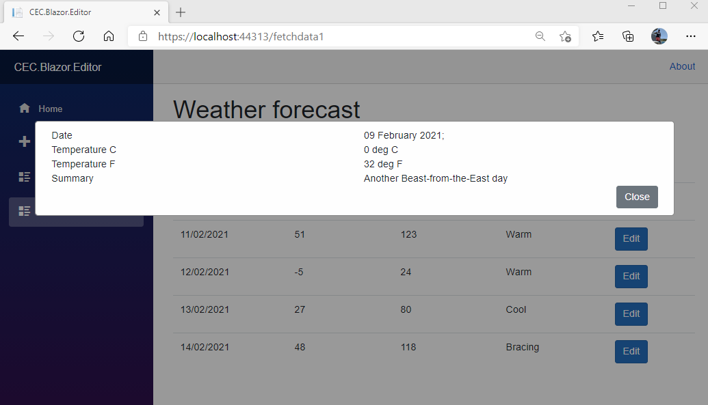

# The Modal Editor

To set the context of this article, there have been many discussions, articles and proposals since Blazor was first released on how to handle edit forms.  Specifically how to stop, or at least warn, the user when leaving a form with unsaved data.  This problem is not specific to Blazor: all Single Page Applications and Web Sites face the same challenges.

In a classic web form, every navigation is a get or a post. We can use the inbuilt `window.beforeunload` event to warn the user that they are leaving the page/site if they don't hit the submit button.  Not great, but at least something - we'll be using it later.  This technique falls flat in SPA's.  What looks to the outsider like a navigation event isn't.  The `NavigationManager` intercepts any navigation attempt from the page, triggers it's own `LocationChanged` event and sinks the request.  The `Router`, wired into this event, does it's wizardry, and loads the new component set into the page.  No real browser navigation actually takes place, so there's nothing for the browser's `beforeunload` event to catch.

It's up to the programmer to write code to stop attempts to move away from a dirty form.  That's easier said than done when your application depends on the URL navigation pretense.  Almost all Toolbars, navigation side bars and many buttons effectively submit URLs to navigate around the application.  Think of the out-of-the-box Blazor template.  There's all the links in the left navigation, about in the top bar,....  

Personally I have a serious issue with the whole routing charade: an SPA is an application, not a website, but I think I must be a minority of one!  This article is for the majority.

All the NetCore 3.1 solutions were cludges in one shape or another, I've created more that one.  What the community hoped for was some changes in NetCore 5, specifically some extra functionality in `NavigationManager` to cancel or block navigation requests.  That didn't happen: I don't think there was team concensus on what was the right solution, so we're back to square one.

What I cover in this article is my latest approach to the problem.  It's not perfect, but I don't think we will every get a near perfect solution until we get some new browser standard that allows us to switch to *SPA* mode and control toolbar navigation.

## Controlling SPA Navigation

The first challenge - How do you stop the user accessing any of the button/links.navigation stuff on the standard page?

1. Build a custom `NavigationManager`.  Not a bad idea, but that's a core bit of Blazor infrastructure that will have many knock on consequences.  I'm stearing clear.
2. Build a custom `Router`.  Also not a bad idea.  I've done this, there's a released package on Nuget, a Github Repo and an article on this site.  It's still a cludge with some issues that I want to get away from.
3. Build a navigation component that you use throughout your application for **ALL** navigation.  Also not a bad idea, but needs rigorous disipline to enforce in any team environment.  One deviation and BANG!
4. Use a Modal Dialog, locking out the rest of the form.  My prefered option and the one I'll explore and develop here.


I'm going to walk you through some **Experimental** code to demonstate what I'm doing in detail.  If you want to follow this, rather than just read, strike up a out-of-the-box Blazor Server application in Visual Studio.  In the code samples below my project is called `CEC.Blazor.Editor`.

> **Experimental** code in definitely not production ready. There's almost no error checking, blah, blah,...  It's miminalist to try and preserve clarity.

## Building the Dialog

First we build a basic modal dialog.  This is CSS framework agnostic. You're welcome to adopt it to fit with Bootstrap et al.

### ModalDialog1

Add a razor component to *Shared* with a code behind file called `ModalDialog1`. Add the following code.  It's a pretend editor for a weather forecast.

> Yes, It's Bootstrap before someone hangs me out to dry for the statement above!

```html
@if (this.Display)
{
    <div class="modal-background">
        <div class="modal-content">
            <div class="container-fluid">
                <div class="row">
                    <div class="col">
                        Date
                    </div>
                    <div class="col">
                        @DateTime.Now.ToLongDateString();
                    </div>
                </div>
                <div class="row">
                    <div class="col">
                        Temperature C
                    </div>
                    <div class="col">
                        0 deg C
                    </div>
                </div>
                <div class="row">
                    <div class="col">
                        Temperature C
                    </div>
                    <div class="col">
                        32 deg F
                    </div>
                </div>
                <div class="row">
                    <div class="col">
                        Summary
                    </div>
                    <div class="col">
                        Another Beast-from-the-East day
                    </div>
                </div>
                <div class="row">
                    <div class="col-12 text-right">
                        <button class="btn btn-secondary" @onclick="() => Hide()">Close</button>
                    </div>
                </div>
            </div>
        </div>
    </div>
}
```
```c#
using Microsoft.AspNetCore.Components;

namespace CEC.Blazor.Editor.Shared
{
    public partial class ModalDialog1 : ComponentBase
    {

        public bool Display { get; private set; }

        public void Show()
        {
            this.Display = true;
            this.InvokeAsync(this.StateHasChanged);
        }

        public void Hide()
        {
            this.Display = false;
            this.InvokeAsync(this.StateHasChanged);
        }
    }
}
```

Note:
1. We're using `Show` to control the display of the modal.  No Javascript and Css required to toggle it.
2. We have two public methods to `Show` or `Hide` the dialog.
3. We invoke `StateHasChanged` to render the component.  There's no external trigger to re-render the component (no Parameters have changed and no UI event has occured), so we need to force a render.  Comment them out and see what happens!

#### FetchData1

We use the `FetchData` page component as our template, so create a new Razor Component in `Pages` and call it `FetchData1`.  Create a `FetchData1.razor.cs` code behind file.  Remember to mark the class as `partial`.

Add the following code.

```html
@page "/fetchdata1"

@using CEC.Blazor.Editor.Data

<h1>Weather forecast</h1>

<p>This component demonstrates fetching data from a service.</p>

@if (forecasts == null)
{
    <p><em>Loading...</em></p>
}
else
{
    <table class="table">
        <thead>
            <tr>
                <th>Date</th>
                <th>Temp. (C)</th>
                <th>Temp. (F)</th>
                <th>Summary</th>
            </tr>
        </thead>
        <tbody>
            @foreach (var forecast in forecasts)
            {
                <tr>
                    <td>@forecast.Date.ToShortDateString()</td>
                    <td>@forecast.TemperatureC</td>
                    <td>@forecast.TemperatureF</td>
                    <td>@forecast.Summary</td>
                    <td><button class="btn btn-primary" @onclick="() => ShowModalDialog()">Edit</button></td>
                </tr>
            }
        </tbody>
    </table>
}

<ModalDialog1 @ref="this.Modal"></ModalDialog1>
```
```c#
using CEC.Blazor.Editor.Data;
using CEC.Blazor.Editor.Shared;
using Microsoft.AspNetCore.Components;
using System;
using System.Threading.Tasks;

namespace CEC.Blazor.Editor.Pages
{
    public partial class FetchData1 : ComponentBase
    {
        [Inject] WeatherForecastService ForecastService { get; set; }

        private WeatherForecast[] forecasts;

        private ModalDialog1 Modal { get; set; }

        protected override async Task OnInitializedAsync()
        {
            forecasts = await ForecastService.GetForecastAsync(DateTime.Now);
        }
        private void ShowModalDialog()
        {
            this.Modal.Show();
        }
    }
}
```

Note:
1. We've added an *Edit* button to each line to access the editor, linked to `ShowModalDialog`.
2. We've added `ModalDialog1` as a component at the bottom of the page, and `@ref` it to a property.
3. We've added a `ModalDialog1` property.
4. We've added a `ShowModalDialog` method to open the Modal Dialog. 

#### NavMenu.razor

We need to add a link in the `NavMenu` to our new page.
```html
        <li class="nav-item px-3">
            <NavLink class="nav-link" href="fetchdata1">
                <span class="oi oi-list-rich" aria-hidden="true"></span> Fetch data 1
            </NavLink>
        </li>

```

#### Site.css

Add the css for the Modal Dialog to the site css file.  We don't add it as a component css file, because we can't edit those on-the-fly while the site is running.  Move the css to the component css file for production code.  

```css
div.modal-background {
    display: block; 
    position: fixed; 
    z-index: 1; /* Sit on top */
    left: 0;
    top: 0;
    width: 100%; /* Full width */
    height: 100%; /* Full height */
    overflow: auto; /* Enable scroll if needed */
    background-color: rgb(0,0,0); /* Fallback color */
    background-color: rgba(0,0,0,0.4); /* Black w/ opacity */
}

div.modal-content {
    background-color: #fefefe;
    margin: 10% auto; 
    padding: 10px;
    border: 2px solid #888;
    width: 90%;
}
```

### Running Version 1

Run the application and go to *FetchData1*.  Click on an edit button.  All of the links on the underlying page are disabled.The three exit paths are:
1. The *Close* button.
2. Enter a new URL.
3. Close the browser tab or close the browser.



## Version 2

Let's now close these three exits.  These are *version2* files in the repo, but you can just update your original files.

### Site.js

Add a *js* folder to *wwwroot*, and add a *site.js* file.

Add the following code.  
1. We define `window.cecblazor_showExitDialog` - an event function that pops up the browser "Are You Sure" implementation.  The actual implementation differs between browsers, but some sort of exit challenge is always raised.
2. We define `window.cecblazor_setEditorExitCheck` which we will call though Blazor's `JsInterop`.

```js
window.cecblazor_setEditorExitCheck = function (show) {
    if (show) {
        window.addEventListener("beforeunload", cecblazor_showExitDialog);
    }
    else {
        window.removeEventListener("beforeunload", cecblazor_showExitDialog);
    }
}

window.cecblazor_showExitDialog = function (event) {
    event.preventDefault();
    event.returnValue = "There are unsaved changes on this page.  Do you want to leave?";
}
```

Next we need to reference this `js` file in our application.  Update `Host._cshtml`

```html
.....
    </div>

    <script src="_framework/blazor.server.js"></script>
    <script src="js/site.js"></script>
</body>
</html>
```

### Modal Dialog

Update the button row in the modal dialog

```html
<div class="row">
    <div class="col-12 text-right">
        <button class="btn @this.DirtyButtonCss" @onclick="() => SetDirty()">@this.DirtyButtonText</button>
        @if (this.DirtyExit)
        {
            <button class="btn btn-danger" @onclick="() => DirtyHide()">Dirty Close</button>
            <button class="btn btn-dark" @onclick="() => CancelHide()">Cancel</button>
        }
        else
        {
            <button class="btn btn-secondary" @onclick="() => Hide()">Close</button>
        }
    </div>
</div>
```

Update the code behind file. It has:

1. Boolean properties - `IsDirty`, `IsLocked` and `DirtyExit` - to control if the control state and button display.
2. Injected `IJSRuntime` for access to `JSInterop`
3. CSS string properties to control the buttons.
4. Various button event handlers to switch the states.  you should be able to work out thwe logic yourself.
5. `SetPageExitCheck` to interact with the page JS, and turn the browser exit chanllenge on and off.


```c#
using Microsoft.AspNetCore.Components;
using Microsoft.JSInterop;

namespace CEC.Blazor.Editor.Shared
{
    public partial class ModalDialog2 : ComponentBase
    {
        [Inject] private IJSRuntime _js { get; set; }

        public bool Display { get; private set; }

        public bool IsDirty { get; set; }

        public bool IsLocked { get; private set; }

        private bool DirtyExit { get; set; }

        private string DirtyButtonCss => this.IsDirty ? "btn-danger" : "btn-success";

        private string DirtyButtonText => this.IsDirty ? "Set Clean" : "Set Dirty";

        public void Show()
        {
            this.Display = true;
            this.InvokeAsync(this.StateHasChanged);
        }

        public void Hide()
        {
            if (this.IsDirty)
                this.DirtyExit = true;
            else
                this.Display = false;
            this.InvokeAsync(this.StateHasChanged);
        }

        public void DirtyHide()
        {
            this.Display = false;
            this.DirtyExit = false;
            if (this.IsDirty)
            {
                this.IsDirty = false;
                CheckLock();
            }
            this.InvokeAsync(this.StateHasChanged);
        }

        public void CancelHide()
        {
            this.DirtyExit = false;
            this.InvokeAsync(this.StateHasChanged);
        }

        public void SetDirty()
        {
            if (this.IsDirty) 
                this.DirtyExit = false;
            this.IsDirty = !this.IsDirty;
            this.CheckLock();
            this.InvokeAsync(this.StateHasChanged);
        }

        public void SetPageExitCheck(bool action)
        {
            _js.InvokeAsync<bool>("cecblazor_setEditorExitCheck", action);
        }

        public void CheckLock()
        {
            if (this.IsDirty && !this.IsLocked)
            {
                this.IsLocked = true;
                this.SetPageExitCheck(true);
            }
            else if (this.IsLocked && !this.IsDirty)
            {
                this.IsLocked = false;
                this.SetPageExitCheck(false);
            }
        }
    }
}
```
### Running Version 2

Now run the application.  Click on an edit button.  All of the links on the underlying page are disabled. Click on *Set Dirty* to simulate editing a field.  Now try to close or navigate away or close the browser.  All the options should be covered

1.  Closing the browser, navigating away in the toolbar, F5 or closing the browser window hits the browser "Do you want to Leave Dialog".
2. Close gives you the *Dirty Exit* option.
3. Clicking anywhere is the page window does nothing.
 


